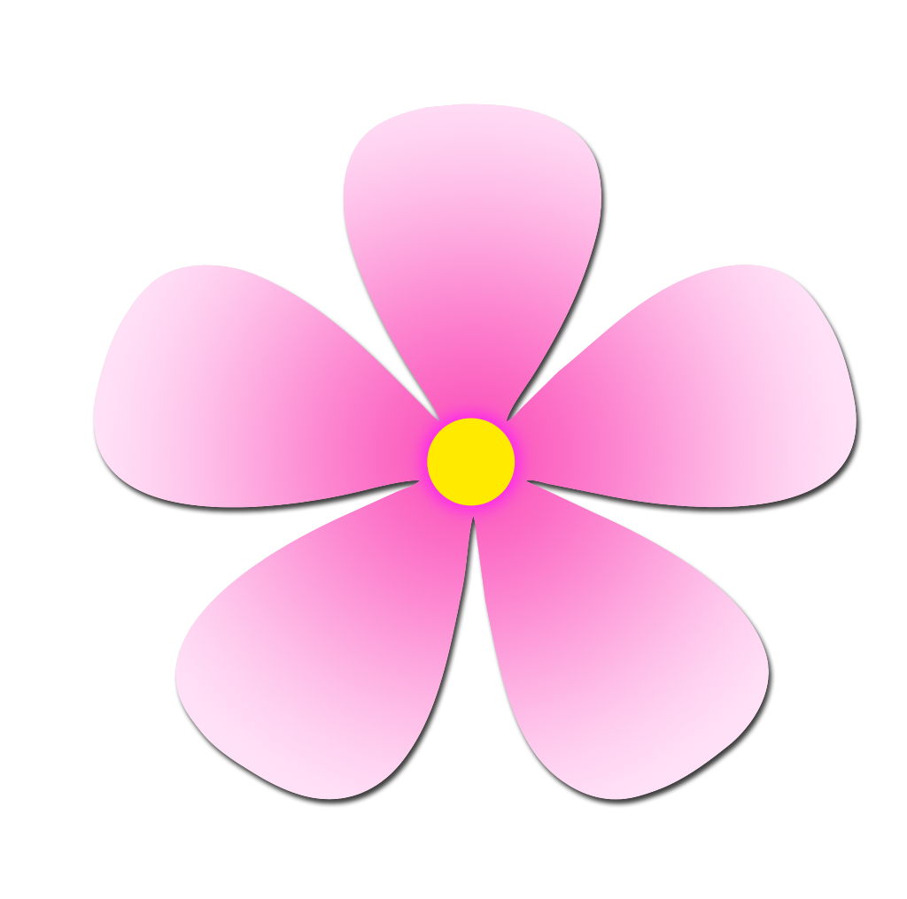
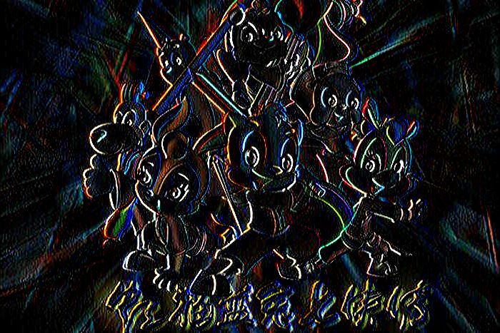
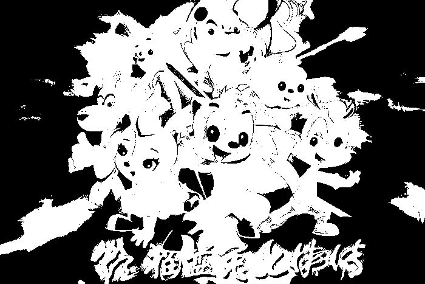

### NodeJS中的图片操作库

一、准备工作
1. 安装`sharp`库
```bash
cnpm i sharp
```
2. 准备待处理图片


3. 在`js`文件中引入`sharp`库
```js
const sharp = require('sharp')
```

二、sharp库的使用
2.1 重置图片的大小
1. 使用`sharp`的构造函数创建一个图片对象，并将原图片重新设置大小为`300 * 200`后输出
```js
const img_name = './images/cat_rabbit.jpg'
const resize_img_name = './images/resize_img.jpg'
sharp(img_name)
    .resize(300, 200)
    .toFile(resize_img_name, err => {
        if (err) console.log(err)
    })
```
2. 处理结果

可以看到，重置图片后，图片大小发生了改变（在PC端比较容易看到）

2.2 旋转图片
1. 使用`sharp`的构造函数创建一个图片对象，并将原图片旋转`180°`后输出
```js
const img_name = './images/cat_rabbit.jpg'
const rotate_img_name = './images/rotate_img.jpg'
sharp(img_name)
    .rotate(180)
    .toFile(rotate_img_name, err => {
        if (err) console.log(err)
    })
```
2. 处理结果图


2.3 `flatten` `alpha`通道图层（为图片添加一个透明的背景色）
该函数的应用，应用在`rgba`格式的图片上，如`png`上效果能够可见
1. 使用`sharp`的构造函数创建一个图片对象，并使用`flatten`为其添加背景色
```js
const img_name = './images/flower.png'
const flatten_img_name = './images/flatten_img.png'
sharp(img_name)
    .rotate(180)
    .toFile(rotate_img_name, err => {
        if (err) console.log(err)
    })
```
2. 处理前后结果对比图



2.4 两张图片进行叠加的操作
1. 使用`composite`函数完成两张图片叠加的操作
```js
const img_name = './images/flower.png'
const composite_img = './images/composite.png'

sharp(img_name)
    .composite([{
        input: './images/cat_rabbit.jpg',
        gravity: 'southeast'    // 从东南角，也就是右下角开始
    }])
    .toFile(composite_img_name, err => {
        if (err) console.log(err)
    })
```
2. 结果图


2.5 将图片转换为`webp`格式
```js
const webp_img = './images/webp_img.png'

sharp(img_name)
    .webp({
        quality: 90
    })
    .toFile(composite_img_name, err => {
        if (err) console.log(err)
    })
```

2.6 将图片转换为`buffer`
```js
sharp(img_name)
    .toBuffer()
    .then(outputBuffer => {
        console.log(outputBuffer)
    })
```

2.7 以`X轴`, `Y轴`作为旋转轴，进行镜像
```js
sharp(img_name)     // 以 X轴 为旋转轴
    .flip(true)
    .toFile('./images/flip_img.jpg', err => {
        if (err) console.log(err)
    })

sharp(img_name)     // 以 Y轴 为旋转轴
    .flop(true)
    .toFile('./images/flop_img.jpg', err => {
        if (err) console.log(err)
    })
```

2.8 使用固定的卷积核对图像进行卷积
1. 以索伯尔卷积滤波为例，使用`convolve`函数进行滤波操作
```js
sharp(img_name)
    .convolve({
        width: 3,
        height: 3,
        kernel: [-1, 0, 1, -2, 0, 2, -1, 0, 1]  // 索伯尔滤波
    })
    .toFile('./images/convolve_img.jpg', err => {
        if (err) console.log(err)
    })
```
2. 索伯尔滤波原图 - 结果图对比图



2.9 进行二值化处理
1. 根据像素值的大小，来决定输出图像的像素值，当像素值大于 固定阈值，则赋值为255，否则，赋值为0，使用`threshold`函数实现
```js
sharp(img_name)
    .threshold(128)
    .toFile('./images/threshold_img.jpg', err => {
        if (err) console.log(err);
    })
```
2. 二值化前后结果对比图



2.8 其余对图片进行操作的函数有
[sharpen(锐化)](https://sharp.pixelplumbing.com/en/stable/api-operation/#sharpen)
[median(中值滤波)](https://sharp.pixelplumbing.com/en/stable/api-operation/#median)
[blur(模糊)](https://sharp.pixelplumbing.com/en/stable/api-operation/#blur)
[flatten(合并`alpha`通道)](https://sharp.pixelplumbing.com/en/stable/api-operation/#flatten)
[gamma](https://sharp.pixelplumbing.com/en/stable/api-operation/#gamma)
[negate(反转显示图像)](https://sharp.pixelplumbing.com/en/stable/api-operation/#negate)
[normalise/normalize(图像均衡化操作)](https://sharp.pixelplumbing.com/en/stable/api-operation/#normalise)
[boolean(二元运算操作)](https://sharp.pixelplumbing.com/en/stable/api-operation/#boolean)
[linear(线性运算)](https://sharp.pixelplumbing.com/en/stable/api-operation/#linear)
[recomb(重整图像)](https://sharp.pixelplumbing.com/en/stable/api-operation/#recomb)
[modulate(调整明亮度)](https://sharp.pixelplumbing.com/en/stable/api-operation/#modulate)

三、图像的相关操作
3.1 图像灰度化
1. 使用`grayscale`函数进行灰度化
```js
sharp(img_name)
    .grayscale(true)
    .toFile('./images/grayscale_img.jpg', err => {
        if (err) console.log(err)
    })
```
2. 灰度化结果图


3.2 提取某个图片中的某个通道
1. 使用`extractChannel`函数
```js
sharp(img_name)
  .extractChannel('green')
  .toFile('green_img.jpg', function(err, info) {
    // info.channels === 1
    // input_green.jpg contains the green channel of the input image
   });
```